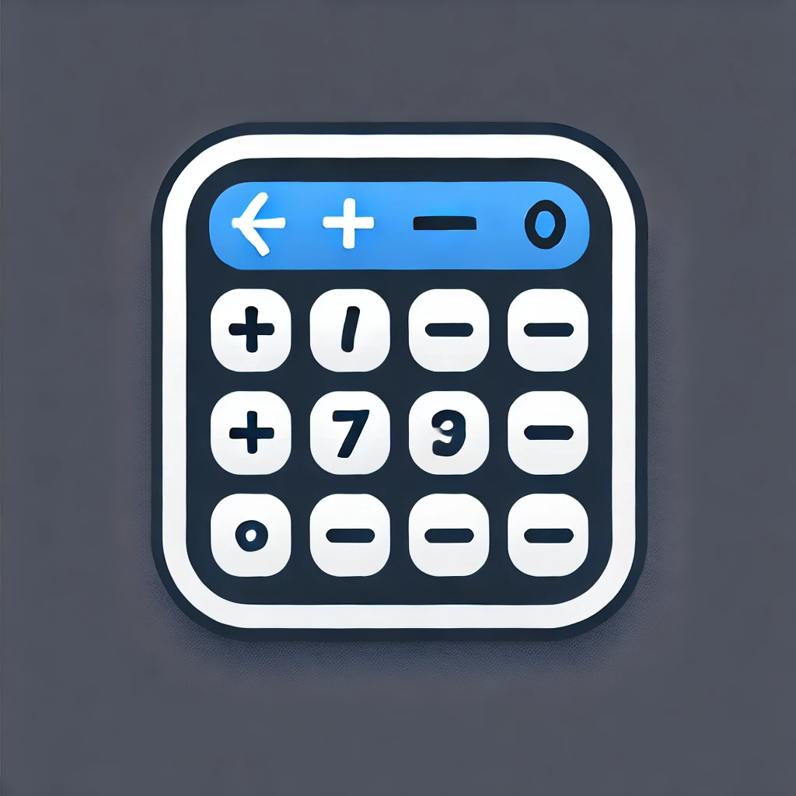
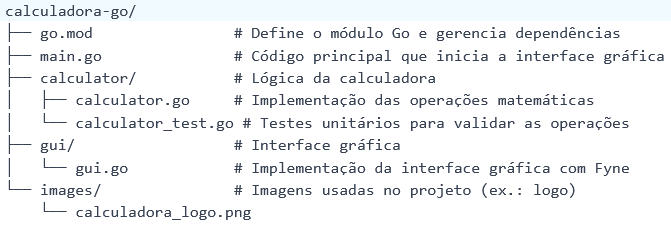
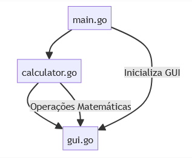
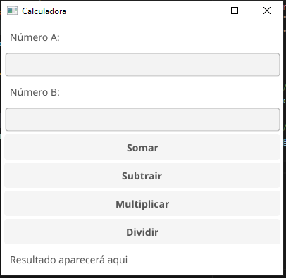

# 📂 Projeto: Calculadora em Go

## 🖍️ Descrição

Este projeto é uma calculadora completa desenvolvida em Go, que oferece operações matemáticas básicas (soma, subtração, multiplicação e divisão) com uma interface gráfica simples e intuitiva. A calculadora também formata os resultados no padrão brasileiro, facilitando a visualização de números com vírgulas como separadores decimais.

🎯 **Objetivo do Projeto**

O principal objetivo deste projeto é demonstrar como criar uma aplicação funcional em Go com uma interface gráfica usando a biblioteca `fyne`. Além disso, o projeto serve como base para aprender sobre organização modular, manipulação de dependências e formatação de dados.

## 🚀 Funcionalidades

- **Operações Matemáticas**: Permite realizar soma, subtração, multiplicação e divisão.
- **Interface Gráfica**: Uma interface gráfica amigável permite inserir números e visualizar os resultados diretamente na tela.
- **Formatação Brasileira**: Os resultados são formatados no padrão brasileiro (vírgula como separador decimal).
- **Organização Modular**: O código está organizado em pastas separadas para melhor manutenção e escalabilidade.

## 📂 Estrutura do Projeto

Abaixo está a estrutura do projeto:

## 🏆 Benefícios do Projeto

- **Simplicidade**: Um exemplo claro e direto para aprender sobre interfaces gráficas em Go.
- **Prática de Formatação**: Demonstra como usar a biblioteca `golang.org/x/text` para formatar números no padrão brasileiro.
- **Base para Projetos Maiores**: Pode ser expandido para incluir mais operações matemáticas, histórico de cálculos ou até mesmo um backend para persistência de dados.

## 🔄 Relacionamento Entre os Módulos

- **main.go**: Inicia a interface gráfica e configura a lógica da calculadora.
- **calculator/calculator.go**: Contém as funções que realizam as operações matemáticas (soma, subtração, multiplicação e divisão).
- **calculator/calculator_test.go**: Contém os testes unitários para validar as operações matemáticas.
- **gui/gui.go**: Implementa a interface gráfica usando a biblioteca `fyne`.
- **images/**: Armazena imagens usadas no projeto, como o logo.

## ⚙️ Pré-requisitos

Antes de executar o projeto, certifique-se de que as seguintes ferramentas estão instaladas no seu sistema:

- **Go**: O projeto foi desenvolvido em Go, então é necessário ter o Go instalado.
  - **Windows**:
    - Baixe o instalador oficial do Go no site: [https://golang.org/dl/](https://golang.org/dl/).
    - Execute o instalador e siga as instruções.
    - Após a instalação, verifique se o Go está configurado corretamente executando:

      go version

      A saída deve exibir a versão instalada, por exemplo:

      go version go1.20 windows/amd64

  - **Linux/macOS**:
    - Use o gerenciador de pacotes do seu sistema para instalar o Go. Por exemplo:

      sudo apt install golang

    - Verifique a instalação com:

      go version

## 🔧 Como Executar

1. **Clone o repositório**:

   git clone <https://github.com/IOVASCON/calculadora-go.git>

2. **Navegue até o diretório do projeto**:

   cd calculadora-go

3. **Instale as dependências**:

   go mod tidy

4. **Execute o programa principal**:

   go run main.go

5. **Interaja com a interface gráfica**:
   A janela da calculadora será exibida. Insira os números nos campos "Número A" e "Número B", clique nos botões das operações e veja os resultados formatados no padrão brasileiro.

   

## 💻 Ambiente Virtual

Ambiente virtual configurado: Não necessário (Go não requer ambiente virtual).

## 📦 Bibliotecas Utilizadas

- **Fyne**: Biblioteca para criar interfaces gráficas em Go ([https://fyne.io/](https://fyne.io/)).
- **golang.org/x/text**: Biblioteca para formatação de texto e números no padrão brasileiro.

## 🚀 Tecnologias Utilizadas

- **Go**: Linguagem de programação utilizada para implementar o projeto.
- **Fyne**: Framework para desenvolvimento de interfaces gráficas.
- **JSON**: Formato de dados utilizado para troca de informações (opcional, caso expanda o projeto).

## 📅 Histórico de Lançamento

- **0.1.0**:
  - ADICIONAR: Implementação básica da calculadora com interface gráfica.
  - ADICIONAR: Formatação de números no padrão brasileiro.
  - CORREÇÃO: Resolução de problemas relacionados à divisão por zero.

## 🙏 Contribuições

Feedbacks e sugestões são sempre bem-vindos! Sinta-se à vontade para abrir issues ou enviar pull requests.

## 👥 Autor

- [GitHub](https://github.com/IOVASCON)

## 🔖 Licença

Este projeto está sob a licença MIT. Consulte o arquivo `LICENSE` para mais detalhes.
